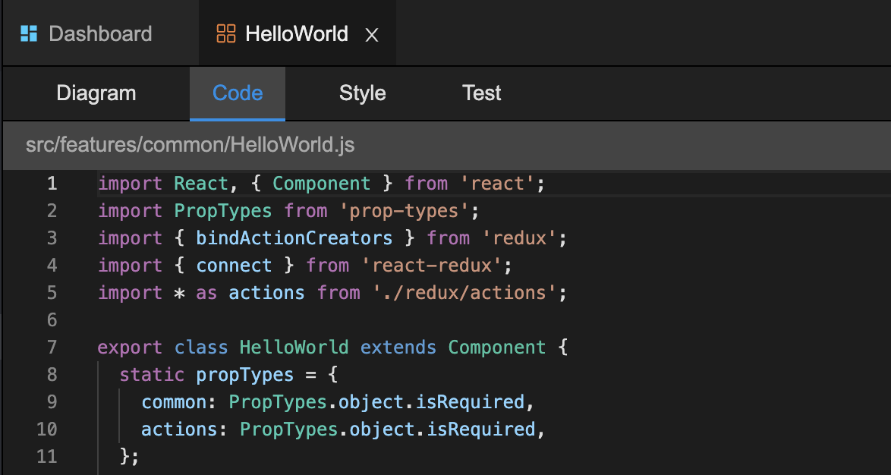

# Provide Project Data

## Introduction

A project element is a virtual element which could consist of a set of files, a folder or even a single file.

## Provide Project Data

Rekit will find plugins with `app.getProjectData` extension point to feed the project data, all returned values from different plugins are merged into the final project data. For example, a plugin may have below structure:

```javascript
module.exports = {
  name: 'my-plugin',
  app: {
    getProjectData() {
      return {
        elements: ['root'],
        elementById: {
          root: { id: 'v:root', name: 'Root', type: 'root' }
        }
      };
    }
  }
};
```

We can see project data should at lease have `elements` and `elementById` properties.

* **elements** It is only used for the project explorer as root nodes.
* **elementById** This is used for mapping `id` to element object.


NOTE: you should make sure all ids in `elements` or any children of element can be found in `elementById` .


Besides `elements` and `elementById` all other fields provided will be sent to client side under the Redux store: `state.home.projectData` . You can also handle Redux action `HOME_FETCH_PROJECT_DATA_SUCCESS` if you need to use it in your plugin. For example, the built in plugin `scripts` which helps to run npm scripts provides `scripts` values to client side so that they can be listed in the UI.

## Element Object Schema

Project element is the key concept for a Rekit project, it is used for:

1. Show an entry in project explorer
2. Show in overview diagram
3. How to show as a tab
4. How to show in main area
5. Quick Open

A sample element object is as below:

```javascript
const element = {
  id: 'v:id',
  name: 'Name',
  type: 'my-type',
  children: ['v:child-id1', 'v:child-id2'],
  views: [],
  parts: ['p1.js', 'p1.css', 'p1.test.js'],
};
```

#### API Description

| property | type | description |
| :--- | :---: | :--- |
| **id** | string | Uniq id for each element |
| **name** | string | Name of the element, showd in project explorer, diagrams, etc. |
| **type** | string | Type of the element, Rekit uses it to determine the color and icon when necessary, it's also useful for plugins to manage it.  |
| **children** | Array&lt;string&gt; | Only used in project explorer to show children of the elements. |
| **views** | Array&lt;Object&gt; | An object array to define sub tabs of the element. |
| **parts** | Array&lt;string&gt; | Virtual element may consist of multiple parts. Used to analyze dependencies and dependents of a virtual element. |
| **target** | string | If a virtual element is an alias of a physical file, set the target to the file id so that editor could open the virtual element as file. |
| **navigable** | bool | If set to true, click it on project explorer will navigate to the url `/element/<element-id>` |
| **icon** | string | Icon of the element, if not set, will use icon of the element type. If set to false value, will not show icon. |
| **iconColor** | string | Hex value of the icon color. If not set, will use color the element type. If set to false value, will show default color, usually `#888` |

## Organize Multiple Files into an Element

## Element in Project Explorer

## Show Element in the Tabs Bar

Rekit usually shows an element in two level tabs structure.



To define sub-tabs of an element, you need to provide `views` property to the element. For example, to show the structure like above picture, you can use code like below:

```javascript
const element = {
  id: 'v:src/Component1.js',
  name: 'Component1',
  vies: [
    { key: 'diagram', name: 'Diagram' },
    { key: 'code', name: 'Code', target: 'src/Component1.js', isDefault: true },
    { key: 'style', name: 'Style', target: 'src/Component1.css' },
    { key: 'test', name: 'Test', target: 'src/Component1.test.js' },
  ],
};
```

## Element in Quick Open

## 

